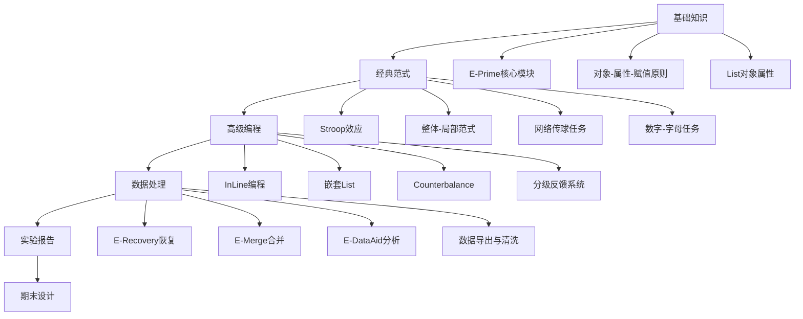

  # 心理学实验编程共享知识库


## 📖 知识库简介

本知识库是面向心理学专业本科生**E-Prime实验编程系统学习资源**，由心理学专业同学共同创建与维护。内容涵盖从基础操作到高级编程技巧的完整知识体系，旨在帮助心理学学习者掌握实验设计、程序编写、数据采集与分析的全流程技能。

本知识库基于深圳大学心理学院乔垒老师《实验心理学》课程讲义整理，整合了Stroop效应、整体-局部范式、网络传球任务等经典心理学实验的实现方案

---

## 🎯 适用对象

| 适用人群 | 前置要求 | 学习建议 |
|---------|---------|---------|
| **心理学本科生** | 已完成《实验心理学》基础课程 | 按章节顺序学习，配合实验报告作业实践 |


---

## 📚 内容结构与学习路径




## 🔧 核心知识点速查

### **1. E-Prime设计哲学**
> **分解为对象 → 设置属性 → 赋值控制**

### **2. 必会对象与属性**
| 对象类型 | 核心属性 | 常用取值 |
|---------|---------|---------|
| **TextDisplay** | `Duration` / `Text` / `FontSize` | 500ms / `[StimWord]` / 24pt |
| **Slide** | `ActiveState` / `BackgroundColor` | "Correct" / 128,128,128 |
| **List** | `Order` / `Weight` / `Nested` | Random / 2 / List2 |
| **InLine** | 代码逻辑控制 | `c.SetAttrib` / `GoTo` |
| **FeedbackDisplay** | `AccStats.Mean` / `Text` | 正确率统计 / 动态文本 |

### **3. 经典范式参数**
<details>
<summary>Stroop效应</summary>

```basic
# 自变量
- 词义-颜色一致性：Congruent / Incongruent
- 刺激材料：红绿黄蓝四字 × 四色

# 反应映射
绿→1键  红→2键  黄→3键  蓝→4键

# 关键代码
If StrComp([StimWord],"绿")=0 And StrComp([StimColor],"green")=0 Then
    c.SetAttrib "Condition","Congruent"
End If
```

</details>

<details>
<summary>整体-局部范式</summary>

```basic
# 材料命名规则
GlobalH_LocalS.bmp  # 整体H由局部S组成

# 休息逻辑
If Mod(TrialNumber,30) = 0 Then
    Rest.Run
End If
```

</details>

<details>
<summary>网络传球任务(Cyberball)</summary>

```basic
# 核心变量
CurrentPlayer = 1  # 球在1号玩家

# 流程跳转
If CurrentPlayer = 2 Then
    GoTo Player2Pass  # 被试决策
End If
```

</details>

---

## 🚀 使用指南

### **方式一：快速查阅**
直接搜索关键词（如`Counterbalance`、`Nested`、`E-Recovery`），知识库提供：
- **实现步骤**：1-2-3分步操作
- **代码模板**：可直接复制的InLine脚本
- **常见错误**：Error 10060 / 属性未定义 / 跳转失效

### **方式二：系统学习**
按周次顺序学习，配合：
1. **课堂PPT**：理解理论背景
2. **操作视频**：看一次完整流程
3. **代码注释**：逐行解读关键脚本
4. **课后练习**：独立完成实验文件

### **方式三：项目驱动**
期末设计时，选择知识库中的**模块组合**：
- 基础框架 → 选择范式 → 添加高级功能 → 数据处理流水线

---

## 📁 资源结构说明(等主包忙完期末考试)

```
Psychology-Experiment-Knowledge/
├── 📂 01_Basics/                    # 基础知识
│   ├── E-Prime_核心模块.md
│   ├── 对象-属性-赋值原则.md
│   └── 数据类型与变量作用域.md
├── 📂 02_Classical_Paradigms/      # 经典范式
│   ├── 01_Stroop效应/
│   │   ├── 实验逻辑.md
│   │   ├── InLine实现.md
│   │   └── 练习自动结束.md
│   ├── 02_整体-局部范式/
│   ├── 03_Cyberball网络传球/
│   └── 04_数字-字母任务/
├── 📂 03_Advanced_Techniques/      # 高级编程
│   ├── 嵌套List(Nested).md
│   ├── Counterbalance设计.md
│   ├── 分级反馈系统.md
│   └── PreRelease优化.md
├── 📂 04_Data_Processing/         # 数据处理
│   ├── E-Recovery数据恢复.md
│   ├── E-Merge数据合并.md
│   └── E-DataAid统计分析.md
├── 📂 05_Experimental_Reports/    # 实验报告
│   ├── 报告模板.docx
│   ├── 数据处理范例.md
│   └── 注意事项.md
├── 📂 06_Final_Project/           # 期末设计
│   ├── 考核要求.md
│   ├── 优秀案例/
│   └── 常见问题解答.md
└── 📂 Resources/                  # 资源文件
    ├── 图片素材/
    ├── 视频素材/
    └── 代码片段库/
```

---

## 👥 协作贡献指南

本知识库采用**协作共建模式**，欢迎贡献：

### **如何参与**
1. **Fork仓库** → 修改完善 → 提交Pull Request
2. **提交Issue**：指出错误、提出需求
3. **补充案例**：上传你的实验设计代码（需脱敏）

### **贡献规范**
```markdown
# 每份文档需包含：
- 知识点名称与编号
- 适用场景与前提条件
- 分步操作（图文结合）
- 完整代码（带注释）
- 常见错误与解决方案
- 参考文献（来源：课堂讲义/论文/官方文档）
```

### **待完善领域**
- [ ] 眼动实验集成方案
- [ ] fMRI/EEG同步触发代码
- [ ] 多因素实验设计模板
- [ ] E-Prime 3.0新功能更新

---

## 📊 知识库统计

| 统计项 | 数量 | 备注 |
|-------|------|------|
| **总文档数** | 45篇 | 持续更新中 |
| **代码片段** | 120+ | 可直接复用 |
| **经典范式** | 8个 | 完整实现方案 |
| **视频教程** | 12个 | bilibili外链 |
| **贡献者** | 23人 | 历届课程同学 |

---

## ⚠️ 版权与使用声明

- **原创内容**：知识库内容由课程同学共同创作，遵循CC BY-NC-SA 4.0协议
- **来源标注**：引用自乔垒老师课堂讲义的内容已获授权
- **商业限制**：禁止将本知识库内容用于商业培训或出版
- **引用规范**：学术引用请注明"心理学实验编程共享知识库，深圳大学心理学院"

---

## 🙏 致谢

**指导老师**：乔垒（深圳大学心理学院）  
**知识库发起人**：2024级心理学专业张同学  

---

## 📞 问题反馈

- **技术问题**：请在Issues中提交（带截图与错误代码）
- **内容建议**：联系知识库维护组 2024341016@mails.szu.edu.cn

---


**最后更新**：2025年12月24日 | **版本**：v1.o

---
